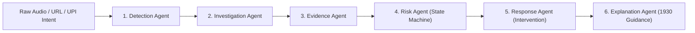

# 🛡️ Guardian AI — Real-Time Digital Scam & Fraud Protection

> **Autonomous, explainable, real-time cyber defense platform inspired by Equal AI — safeguarding users from digital arrest extortion, contraband customs scams, UPI reverse-debit traps, phishing links, and OTP harvesting.**

[](https://opensource.org/licenses/MIT)
[](https://fastapi.tiangolo.com)
[](https://nextjs.org)
[](https://developer.android.com)

---

## 🌟 Product Vision & Paradigm Shift

Current scam-detection applications fail because they require the victim to already suspect something is dangerous. When high-pressure extortion occurs (such as a fake Police Digital Arrest or urgent Customs contraband notice), fear bypasses rational suspicion.

**Guardian AI changes the paradigm from passive checking to autonomous, real-time protection.** It acts as a proactive security agent that intervenes *before* financial loss or credential leakage occurs.

```
┌───────────────────────────────────────────────────────────────────────────────────┐
│                           GUARDIAN MULTI-VECTOR DEFENSE                           │
├───────────────────┬───────────────────┬───────────────────┬───────────────────────┤
│ 🎙️ Call Assistant │ 🌐 Pre-Nav URL    │ 💳 Pre-Handoff UPI│ 📲 Android Shield     │
│ Continuous Speech │ Local DNS / VPN   │ Deep-link hook    │ NotificationListener  │
│ Live STT/TTS Voice│ Phishing Blocker  │ Reverse-debit halt│ Real-time SMS triage  │
└───────────────────┴───────────────────┴───────────────────┴───────────────────────┘
```

---

## 🚀 Key Capabilities

### 1. 🎙️ Equal AI-Inspired Real-Time Call Assistant
* **Continuous Hands-Free Speech Streaming:** Listens to incoming caller speech via Web Speech Recognition (`16kHz` continuous stream) with sub-second interim keyword detection.
* **Autonomous Decision & Audible AI Counter-Interventions:** Guardian AI speaks back over the phone line using Web Speech Synthesis, citing Indian law, IT Act, and RBI circulars to neutralize scammers.
* **Multi-Vector Indian Cybercrime Detection:**
  * 🚨 **Digital Arrest Extortion:** Fake CBI/Police video detention claims (giving zero legal validity notices).
  * 🚨 **FedEx / Customs Contraband Scheme:** Intercepted narcotics/passport courier traps.
  * ⚠️ **Electricity Power Cut at 9:30 PM:** Screen-sharing APK / QuickSupport extortion.
  * ⚠️ **TRAI / SIM 2-Hour Deactivation:** Telecom KYC credential harvesting.
* **1-Tap Counter-Intervention Chips:** Instantly demand Police Badge & Station ID, cite RBI circulars, or log evidence for National Cybercrime Portal (`1930`).

### 2. 🌐 Pre-Navigation Phishing & Homoglyph URL Shield
* Intercepts browser links before network dispatch.
* Analyzes typosquatting (e.g. `hdfc-bankk-kyc.top`), homoglyphs (e.g. `paypa1-...`), brand spoofing, and disposable `.top`/`.xyz` kits.

### 3. 💳 Real-Time Pre-Handoff UPI & QR Shield
* Inspects `upi://pay` deep-links before launching PhonePe, Google Pay, or Paytm.
* Detects **Reverse-Debit Traps** where an outbound money deduction (e.g. ₹8,500) is deceptive framed as an inbound refund credit.

### 4. 📲 Real-Time Android Notification & SMS Listener
* Production-grade `NotificationListenerService` hooks `onNotificationPosted()` off the main thread.
* Triages incoming SMS and WhatsApp alerts in `<15ms` for urgent OTP solicitation and fake lottery links.

### 5. 🎯 Threat Demo Center & Attack Lab
* **Live Scannable Scam QR Codes:** Point your phone camera directly at the monitor to scan real reverse-debit and phishing QR codes.
* **Scam Audio Voice Player:** Plays loud voice extortion clips through computer speakers so your phone's microphone can listen and test live.

---

## 🏗️ Multi-Agent Architecture

Guardian uses a 6-stage explainable agentic pipeline:



1. **Detection Agent:** Tokenizes cues (`AUTHORITY_CLAIM`, `DIGITAL_ARREST_COERCION`, `PAYMENT_DEMAND`, `OTP_REQUEST`, `URGENCY_PRESSURE`).
2. **Investigation Agent:** Evaluates conversation trajectory and calculates signal corroboration weights.
3. **Evidence Agent:** Synthesizes evidence matrices with confidence scoring and uncertainty margins.
4. **Risk Agent:** Enforces dynamic risk state transitions (`SAFE` $\rightarrow$ `SUSPICIOUS` $\rightarrow$ `HIGH` $\rightarrow$ `CRITICAL`).
5. **Response Agent:** Formulates legally grounded AI speech dialogue and determines blocking overlays.
6. **Explanation Agent:** Generates clear, plain-language reasoning, safe actions, and reporting steps for `cybercrime.gov.in` (Helpline 1930).

---

## 📂 Repository Structure

```
├── android_app/                     # Native Android Kotlin application (API 34)
│   ├── app/src/main/java/com/guardian/ai/
│   │   ├── services/                # InCallService, NotificationListener, AccessibilityService, VpnService
│   │   ├── engine/                  # LocalRiskEngine (sub-10ms triage)
│   │   └── ui/                      # Jetpack Compose mobile dashboard & heads-up overlays
├── backend/                         # FastAPI 2.0 Real-time Defense API
│   ├── app/
│   │   ├── agents/                  # 6 Modular Cyber Defense Agents
│   │   ├── modules/                 # Heuristic engines, audio analysis, risk scoring
│   │   ├── api_routes.py            # REST endpoints for Call, URL, UPI, Auth, APK download
│   │   ├── events_manager.py        # WebSocket real-time telemetry hub
│   │   ├── guardian_db.py           # SQLite database persistence
│   │   ├── pipeline_guardian.py     # End-to-end pipeline coordinator
│   │   └── main.py                  # Server entry point
├── frontend/                        # Next.js 14 Web Dashboard & Mobile Simulator
│   ├── src/
│   │   ├── app/                     # Next.js App Router (Dashboard, SOC Insights)
│   │   ├── components/
│   │   │   ├── GuardianMobileSimulator.tsx  # Continuous STT/TTS Mobile Simulator
│   │   │   ├── GuardianDemoCenter.tsx       # Scannable QR Codes & Audio Voice Player
│   │   │   ├── GuardianDashboard.tsx        # Live SOC Telemetry
│   │   │   └── GuardianIncidentsView.tsx    # Evidence & Audit Logs
│   │   └── lib/                     # API client & WebSocket connections
└── README.md
```

---

## ⚡ Quick Start & Installation

### Prerequisites
* **Python 3.11+**
* **Node.js 18+ & npm**
* *(Optional)* Android Studio Jellyfish / Iguana for native APK build

---

### 1. Start the Backend API Server

```bash
cd backend
python -m venv venv
# On Windows:
.\venv\Scripts\activate
# On Linux/macOS:
source venv/bin/activate

pip install -r requirements.txt
python -m uvicorn app.main:app --host 0.0.0.0 --port 8000 --reload
```
* **API Documentation:** [http://localhost:8000/docs](http://localhost:8000/docs)
* **Health Check:** [http://localhost:8000/api/health](http://localhost:8000/api/health)

---

### 2. Start the Frontend Dashboard & Simulator

```bash
cd frontend
npm install
npm run dev -- -p 3000
```
* **Web App (PC):** [http://localhost:3000](http://localhost:3000)
* **Mobile Access (Same Wi-Fi):** `http://<YOUR_PC_IP>:3000` (e.g. `http://192.168.29.62:3000`)

---

### 3. Open the Android Application in Android Studio

1. Open Android Studio $\rightarrow$ Click **Open Project**.
2. Select the directory: `android_app/`.
3. Sync Gradle and run on a connected Android phone or Android Virtual Device (AVD).
4. Grant **Overlay Permission** and **Notification Access** when prompted.

---

## 🔑 Default Demo Credentials

* **Email / Username:** `demo@guardian.app`
* **Password:** `guardian123`

---

## 🛡️ License

This project is licensed under the MIT License — see the [LICENSE](LICENSE) file for details.
